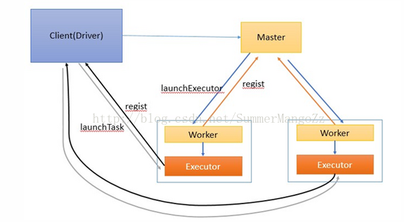
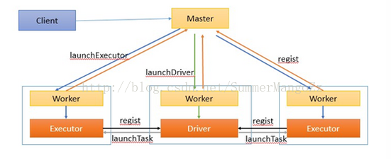

# SparkPlay

[Spark on K8s](SparkOnK8s/README.md)

## Spark Running mode

### Client Mode

In client mode, the driver is launched in the same process as the client that submits the application

1. 启动master和worker . worker负责整个集群的资源管理，worker负责监控自己的cpu,内存信息并定时向master汇报
2. 在client中启动Driver进程，并向master注册
3. master通过rpc与worker进行通信，通知worker启动一个或多个executor进程
4. executor进程向Driver注册，告知Driver自身的信息，包括所在节点的host等
5. Driver对job进行划分stage，并对stage进行更进一步的划分，将一条pipeline中的所有操作封装成一task，并发送到向自己注册的executor进程中的task线程中执行
6. 应用程序执行完成，Driver进程退出

### Cluster Mode

In cluster mode, however, the driver is launched from one of the Worker processes inside the cluster, and the client process exits as soon as it fulfills its responsibility of submitting the application without waiting for the application to finish.

1. 在集群的节点中，启动master , worker进程，worker进程启动成功后，会向Master进行注册。
2. 客户端提交任务后，ActorSelection（master的actor引用）,然后通过ActorSelection给Master发送注册Driver请求（RequestSubmitDriver）
3. 客户端提交任务后，master通知worker节点启动driver进程。(worker的选择是随意的，只要worker有足够的资源即可)driver进程启动成功后，将向Master返回注册成功信息
4. master通知worker启动executor进程
5. 启动成功后的executor进程向driver进行注册
6. Driver对job进行划分stage，并对stage进行更进一步的划分，将一条pipeline中的所有操作封装成一个task，并发送到向自己注册的executor进程中的task线程中执行
7. 所有task执行完毕后，程序结束。
